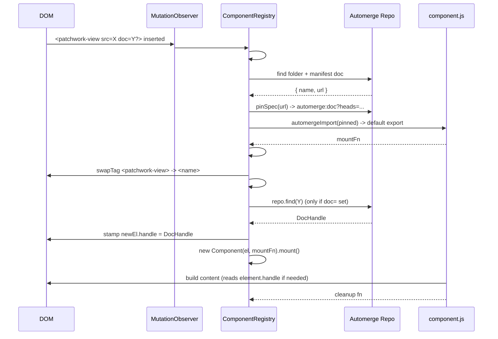

# Components

Declarative loading of ES modules out of the Automerge graph as live DOM
components. Each component is a folder with a JSON manifest and a JS module;
pages embed them with `<patchwork-view src="automerge:...">`. The registry
watches the DOM, fetches the referenced sources, and mounts them — including
hot reloads when the underlying Automerge folder changes.

This builds on top of the loader described in
[`README.md`](../README.md): `automergeImport(spec)` resolves an
`automerge:` URL to an executable ES module via blob URLs. The component
system layers a manifest format and a DOM lifecycle on top.

## Concepts

- **Component package.** A folder document containing `component.json` (the
  manifest) and the file the manifest points at — typically `component.js`.
  Pushed independently with `pushwork`, so each package has a stable
  `rootDirectoryUrl` that can be referenced from other components or pages.
- **Manifest.** A JSON document with `{ name, url }`. `name` is the custom
  tag name the component will mount under (must contain a hyphen, per HTML
  custom-element rules). `url` is a `./`-relative path to the JS module.
- **Mount fn.** The default export of `component.js`. An async function
  that gets the host element and returns an optional cleanup. Equivalent
  to `(element: HTMLElement) => Promise<(() => void) | void>`.
- **Bootstrap tag.** `<patchwork-view src="automerge:.../component.json">`.
  The registry's only hard-coded mount tag. Defined as an autonomous
  custom element with `src` and `doc` accessors that reflect to attributes,
  so framework property-writes on hyphenated tags (Solid, Lit, …) flow back
  through `setAttribute`.
- **Repo scope.** `<automerge-repo>` is a marker custom element. The
  registry stamps a `Repo` reference onto every `<automerge-repo>` it
  discovers; descendant `<patchwork-view doc="...">` elements look it up
  via `closest("automerge-repo").repo` to resolve the doc URL into a
  `DocHandle`.
- **Component registry.** A per-root orchestrator owning a `MutationObserver`,
  the bootstrap-load cache, the name table, and the set of mounted instances.

## Authoring a component

A package is two files (plus a `.pushwork` folder once published):

```
packages/counter/
  component.json
  component.js
```

`component.json`:

```json
{
  "name": "my-counter",
  "url": "./component.js"
}
```

`component.js` — bundleless, imports are resolved by `automergeImport`'s
specifier rewriter (so `https://esm.sh/...` URLs work as-is, and relative
paths walk the package's folder doc):

```js
import { createSignal } from "https://esm.sh/solid-js@1.9.5";
import { render } from "https://esm.sh/solid-js@1.9.5/web";
import html from "https://esm.sh/solid-js@1.9.5/html";

function Counter() {
  const [count, setCount] = createSignal(0);
  return html`
    <button type="button" onClick=${() => setCount(count() + 1)}>
      count: ${count}
    </button>
  `;
}

export default async function (element) {
  return render(() => Counter(), element);
}
```

The mount fn:

- runs in the browser with the live host `element` already in the DOM,
- can `await` anything (network, `repo.find`, dynamic imports) before
  touching the element,
- should return a function that tears down whatever it set up — listeners,
  intervals, framework dispose handles. The example above returns
  `render`'s dispose, which clears reactive owners and resets the
  element's `textContent`.

A component that doesn't need cleanup just returns nothing.

## Using a component on a page

`<patchwork-view>` is the only entry point:

```html
<script src="./dist/overlock.js"></script>

<patchwork-view
  src="automerge:3F8HWx9Hm8JDDrSA1GZP9fRGSXi9/component.json"
></patchwork-view>

<script type="module">
  await window.isPatchworkReady;
  window.createComponentRegistry(document.body);
</script>
```

`createComponentRegistry(root)` is the factory exposed by
[`src/main.ts`](../src/main.ts); it closes over the bootstrapped `repo`
and `automergeImport` and only requires you to pick a root element (almost
always `document.body`).

## Composition: components inside components

Inside a component's JS, you can drop another `<patchwork-view>` and the
registry's observer will pick it up and bootstrap it the same way. URLs
are referenced directly — there's no attribute pass-through:

```js
const COUNTER_SRC = "automerge:4NdChAJ19xmag7Ae5sBnShBUq95i/component.json";
const CLOCK_SRC = "automerge:2Xa2AQP4fg2MfuKc47pn7RmT6ZDB/component.json";

function App() {
  return html`
    <h1>demo</h1>
    <patchwork-view src="${COUNTER_SRC}"></patchwork-view>
    <patchwork-view src="${CLOCK_SRC}"></patchwork-view>
  `;
}

export default async function (element) {
  return render(() => App(), element);
}
```

Each `<patchwork-view>` carries exactly one `src`, plus an optional
`doc` for binding to an Automerge document (see ["Working with
documents"](#working-with-documents)). Multiple `<patchwork-view>`
siblings = multiple bootstrapped components.

Sibling URLs are stable across re-pushes because each subpackage's
`.pushwork/` snapshot pins its own `rootDirectoryUrl`. Copy them out of
`packages/<name>/.pushwork/snapshot.json`.

## Working with documents

Components opt into Automerge documents in two complementary ways: by
asking the *repo* itself (e.g. to create a new doc) and by receiving a
`DocHandle` to an *existing* doc.

### `<automerge-repo>` — repo scope

Wrap any subtree that should resolve doc handles in `<automerge-repo>`:

```html
<automerge-repo>
  <patchwork-view src="automerge:.../my-app/component.json"></patchwork-view>
</automerge-repo>
```

`<automerge-repo>` is a no-op marker tag. The registry walks the subtree
on construction (and on every `MutationObserver` insertion) and assigns
`el.repo = registry.repo` to each one. Components reach the repo with:

```js
const repo = element.closest("automerge-repo")?.repo;
```

There is exactly one `Repo` in the page today — the global one set up in
[`src/main.ts`](../src/main.ts) — so the marker is mostly a future-proofing
boundary. Resolving `closest("automerge-repo")` is the single API; whether
that maps to a global, per-tree, or per-component repo is the registry's
business.

### `doc=` attribute on `<patchwork-view>`

Set `doc=` to an `automerge:...` URL to ask the registry for a `DocHandle`
to that document before your mount fn runs:

```html
<automerge-repo>
  <patchwork-view
    doc="automerge:..."
    src="automerge:.../counter/component.json"
  ></patchwork-view>
</automerge-repo>
```

The registry resolves the URL against the closest `<automerge-repo>`, awaits
`repo.find(url)`, and stamps the resulting handle onto the swapped element
as a JS property (`el.handle`). The mount fn picks it up directly:

```js
import { makeDocumentProjection } from
  "https://esm.sh/@automerge/automerge-repo-solid-primitives@2.5.5?deps=solid-js@1.9.5";

export default async function (element) {
  const handle = element.handle;
  const doc = makeDocumentProjection(handle);
  return render(
    () => html`
      <button onClick=${() => handle.change(d => d.count++)}>
        count: ${() => doc.count ?? 0}
      </button>
    `,
    element,
  );
}
```

`makeDocumentProjection` is the no-reactive-input primitive from
[`automerge-repo-solid-primitives`](https://github.com/automerge/automerge-repo/tree/main/packages/automerge-repo-solid-primitives).
It hands back a fine-grained Solid store proxy that updates on every
incoming patch. Component authors can also drop down to plain
`handle.doc()` and `handle.on("change", ...)` if they don't want a
framework primitive.

`doc=` is strict: present without an `<automerge-repo>` ancestor, the
mount is aborted with an error. Absent, `el.handle` stays `undefined` and
the component runs as before — `clock` does this and just renders local
state.

### Reactive `doc=`

The `MutationObserver` watches `doc` attribute changes on every element
in its tree (`{ attributes: true, attributeFilter: ["doc"] }`). When the
attribute changes on a *mounted* component, the registry rebuilds the
instance under the same tag name and mount fn — same teardown + recreate
dance as HMR (see ["Hot module reload"](#hot-module-reload)). The new
element's `el.handle` reflects the new URL; the component's cleanup runs
between the old and new mount.

A change to `doc=` on a `<patchwork-view>` *before* bootstrap completes
is picked up naturally — bootstrap reads the attribute when it resolves
the context, and an in-flight resolve is just superseded by the rebuild.

## Lifecycle



When `<name>` is later removed from the DOM, the observer fires for the
removal, the registry calls `Component.unmount()`, and the cleanup runs.

## Hot module reload

The registry subscribes to the manifest's *parent folder* document on
load. Pushwork propagates child writes upward, so any change inside the
component's package — manifest, JS, anything — fires a `change` event on
the parent folder handle.

On change, the registry:

1. Re-fetches the manifest and re-imports the JS (with a heads-pinned
   spec so `automergeImport`'s blob cache produces a fresh module).
2. No-ops if both `manifest.name` and the `mountFn` reference are
   unchanged (defends against spurious change events).
3. If `manifest.name` changed, drops the old name from the registry and
   throws if the new name collides with an existing entry.
4. For every `Component` currently mounted under the previous tag name:
   tears it down (runs cleanup), creates a fresh element under the new
   tag name (carrying the current attrs and children), inserts it in
   place, and mounts the new mount fn.

Element identity is intentionally lost on reload — the chosen semantics
is "teardown + remount", not "patch in place". That keeps the cleanup
contract honest: every reload runs the previous cleanup before the new
mount fn touches anything.

## Race handling

`mount()` is async. Three things can race it:

1. The element is removed from the DOM before the mount fn resolves.
2. The component is hot-reloaded before the mount fn resolves.
3. The `doc=` attribute changes before the mount fn resolves.

Cases 2 and 3 both go through `#rebuildInstance`, so the same generation
counter on the `Component` handles them. `unmount()` (and
`#rebuildInstance`'s teardown) bumps the generation; when the in-flight
`mount()` finally resolves, it checks the generation it captured at call
time and — if it lost — runs the returned cleanup immediately and
discards it instead of installing it.

The async `#resolveContext(el)` step (the `repo.find(docUrl)` await) sits
*before* the user's mount fn. If the element is removed during that
await, the post-await `isConnected` check short-circuits and the user's
mount fn is never invoked.

That preserves the "for every successful mount, exactly one cleanup
runs" invariant even when the user's mount fn is doing something slow.

## Why `<patchwork-view>` and `<automerge-repo>` are custom elements

Two registrations live in
[`src/components/component-registry.ts`](../src/components/component-registry.ts):

```ts
class PatchworkView extends HTMLElement {
  get src(): string { return this.getAttribute("src") ?? ""; }
  set src(v: string) { this.setAttribute("src", String(v ?? "")); }
  get doc(): string { return this.getAttribute("doc") ?? ""; }
  set doc(v: string) { this.setAttribute("doc", String(v ?? "")); }
}
class AutomergeRepoElement extends HTMLElement {
  repo: Repo | null = null;
}
```

Frameworks that template-render hyphenated tags tend to write attribute
slots as JS *properties* (Solid does, Lit does). On a plain
`HTMLElement` that's a JS expando — never reflects to the attribute, so
the registry's `getAttribute(...)` read sees nothing. Reflecting `src`
and `doc` accessors back through `setAttribute` keeps the
MutationObserver-based bootstrap working.

`AutomergeRepoElement` doesn't reflect anything — `repo` is a typed
*property* slot for the registry to write into and for components to read
out of. Putting it on a registered class instead of a plain expando just
means TypeScript / DevTools recognize it.

These are the *only* two places in the system that use `customElements`.
User components stay plain `document.createElement(name)` elements and
are never registered globally — `customElements.define` is a one-shot
ratchet that would block HMR. Component identity instead lives in:

- `componentStore` — a process-wide `WeakMap<Element, Component>` for
  element-to-instance lookup,
- the registry's private `#registry: Map<string, MountFn>` for
  name-to-mount-fn,
- the registry's private `#mounted: Set<Component>` for iteration on
  HMR / destroy.

## Module layout

```
src/components/
  component-registry.ts   ComponentRegistry, PatchworkView, manifest/spec
                          parsing helpers
  component.ts            Component lifecycle: async mount, cleanup,
                          generation guard
  component-store.ts      Singleton WeakMap<Element, Component>
  types.ts                ComponentManifest, MountFn
  index.ts                public re-exports
```

The registry depends on the loader half of overlock for two things:

- `repo: Repo` — used to resolve folders, manifests, and read `.heads()`
  for pinning.
- `automergeImport: (spec) => Promise<unknown>` — used to fetch and
  evaluate `component.js` as an ES module.

Both are wired up in [`src/main.ts`](../src/main.ts) and exposed
through `window.createComponentRegistry(root)`.

## Constraints and limits

- **Tag names need a hyphen.** Enforced when reading the manifest. This
  matches the HTML custom-element naming rule and avoids accidental
  collisions with built-ins.
- **Manifest `url` must start with `./`.** Cross-package and bare
  specifiers in the manifest are rejected so HMR's pinning semantics
  stay obvious — the JS module always lives in the same folder doc as
  its manifest.
- **No namespaces yet.** Component name collisions throw immediately,
  both on initial load and on HMR rename.
- **`doc=` requires `<automerge-repo>`.** Setting `doc=` on a
  `<patchwork-view>` outside any `<automerge-repo>` ancestor is an
  error; the mount is aborted with a logged exception. Components that
  don't need a doc (e.g. `clock`) work fine with no scope.
- **No `parentComponent` / `closestComponent` yet.** The element handed
  to a mount fn is a plain `HTMLElement` plus an optional `el.handle`.
  The `componentStore` is in place so ancestor-component lookups can
  land later without reshuffling the lifecycle.
- **No schema validation.** A component's input contract (attributes,
  children, `el.handle` document shape) is whatever its mount fn chooses
  to read.
