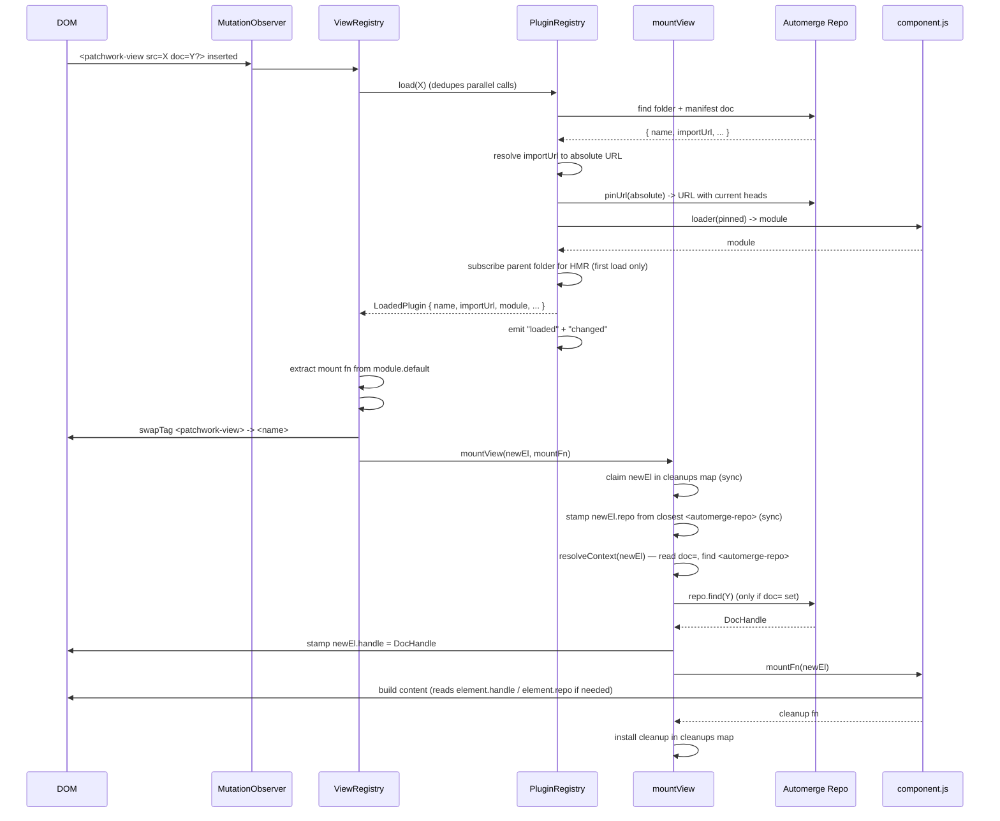

# Lifecycle

Mount/unmount sequence, hot module reload, and race handling for the
view registry. Reads the source it documents:
[`src/view-registry.ts`](../src/view-registry.ts),
[`src/plugin-registry.ts`](../src/plugin-registry.ts), and
[`src/view.ts`](../src/view.ts).

## Mount sequence



The view registry installs a single `pluginRegistry.on("updated", ...)`
listener in its constructor so subsequent folder changes flow back
to `#onPluginUpdate` (see below). The listener is an arrow-function
field detached via `pluginRegistry.off(...)` in `destroy()`. One
global listener fans out updates for every plugin URL — there's no
per-URL subscription.

When `<name>` is later removed from the DOM, the observer fires for
the removal and the registry calls `unmountView(el)`, which runs
the installed cleanup and forgets the element.

## Hot module reload

The plugin registry subscribes to the manifest's *parent folder*
document on first load. Pushwork propagates child writes upward, so
any change inside the view's package — manifest, JS, anything —
fires a `change` event on the parent folder handle.

On change, the **plugin registry**:

1. Re-fetches the manifest and re-imports the JS (with a heads-pinned
   URL so the loader's blob cache produces a fresh module).
2. Splices the fresh `LoadedPlugin` into its cached record.
3. Emits `updated(pluginUrl, previous, next)` and `changed()`.

The **view registry**'s `#onPluginUpdate` handler then:

1. No-ops if both `name` and the `module` reference are unchanged
   (defends against spurious change events; the plugin registry
   doesn't pre-dedup).
2. Bails if the previous load wasn't view-shaped — there's nothing in
   the name table to update.
3. Tries to extract a fresh mount fn from `next.module.default`.
   If extraction fails (the new module isn't view-shaped), tears
   down every existing instance under the previous tag name and
   removes those elements from the DOM. Otherwise:
4. If `name` changed, drops the old name from the name table and
   throws if the new name collides with an existing entry.
5. Sets the new name → mountFn entry.
6. For every element currently mounted under the previous tag name
   (found by walking the registry's root looking for the tag, filtered
   by `isView`): tears it down via `unmountView` (runs the installed
   cleanup), creates a fresh element under the new tag name (carrying
   the current attrs and children), inserts it in place, and calls
   `mountView` against the new element.

Element identity is intentionally lost on reload — the chosen
semantics is "teardown + remount", not "patch in place". That keeps
the cleanup contract honest: every reload runs the previous cleanup
before the new mount fn touches anything.

## Race handling

`mountView` is async. Three things can race it:

1. The element is removed from the DOM before the mount fn resolves.
2. The view is hot-reloaded before the mount fn resolves.
3. The `doc=` attribute changes before the mount fn resolves.

Cases 2 and 3 both go through `#rebuildInstance`, which detaches the
old element (running `unmountView` on it first) and creates a fresh
one. The element is the identity carrier for a mounted view; there is
no separate `View` instance to signal. The race guarantee falls out
of two facts:

- `mountView` reads `el.isConnected` after every `await`. A
  detached element short-circuits the post-await branch.
- The user's returned cleanup is run-and-discarded (rather than
  installed) when the post-`await mountFn` `isConnected` check is
  false.

Concretely, `mountView` looks like:

```
claim el in cleanups map         (sync)
stamp el.repo                    (sync)
await resolveContext(el)
  if el disconnected → drop claim, return
await mountFn(el)
  if el disconnected → run-and-discard cleanup, drop claim, return
install cleanup in cleanups map
```

The `cleanups` map (in `view.ts`) is the only persistent per-view
state in the system. There is no four-state enum, no teardown set,
no `View.unmount()` method — just an element that has or hasn't been
claimed, and (after a successful mount) an optional cleanup keyed by
that element.

`doc=` rebuilds are **microtask-batched**: a series of synchronous
writes in the same tick (e.g. a context-provider walking through
several intermediate URLs in one Solid effect) coalesce into a single
rebuild that reads the final attribute value. Without batching, the
descendant would tear down and re-mount once per write.

That preserves the "for every successful mount, exactly one cleanup
runs" invariant even when the user's mount fn is doing something
slow.
