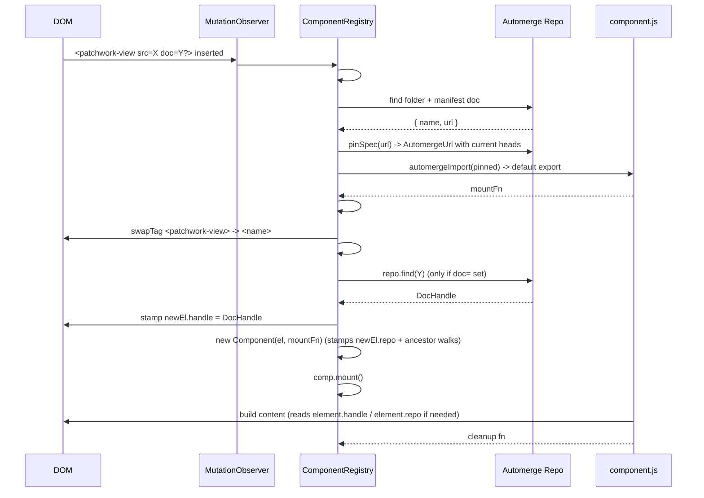

# Lifecycle

Mount/unmount sequence, hot module reload, and race handling for the
component registry. Reads the source it documents:
[`src/components/component-registry.ts`](../src/components/component-registry.ts)
and [`src/components/component.ts`](../src/components/component.ts).

## Mount sequence



When `<name>` is later removed from the DOM, the observer fires for
the removal, the registry calls `Component.unmount()`, and the
cleanup runs.

## Hot module reload

The registry subscribes to the manifest's *parent folder* document on
load. Pushwork propagates child writes upward, so any change inside
the component's package — manifest, JS, anything — fires a `change`
event on the parent folder handle.

On change, the registry:

1. Re-fetches the manifest and re-imports the JS (with a heads-pinned
   spec so `automergeImport`'s blob cache produces a fresh module).
2. No-ops if both `manifest.name` and the `mountFn` reference are
   unchanged (defends against spurious change events).
3. If `manifest.name` changed, drops the old name from the registry
   and throws if the new name collides with an existing entry.
4. For every `Component` currently mounted under the previous tag
   name: tears it down (runs cleanup), creates a fresh element under
   the new tag name (carrying the current attrs and children),
   inserts it in place, and mounts the new mount fn.

Element identity is intentionally lost on reload — the chosen
semantics is "teardown + remount", not "patch in place". That keeps
the cleanup contract honest: every reload runs the previous cleanup
before the new mount fn touches anything.

## Race handling

`mount()` is async. Three things can race it:

1. The element is removed from the DOM before the mount fn resolves.
2. The component is hot-reloaded before the mount fn resolves.
3. The `doc=` attribute changes before the mount fn resolves.

Cases 2 and 3 both go through `#rebuildInstance`, which calls
`unmount()` on the old `Component` and constructs a fresh one. Each
`Component` carries a four-state lifecycle:

```
idle → mounting → mounted → unmounted
```

`mount()` transitions `idle → mounting`, awaits the user's mount fn,
then either installs the returned cleanup and transitions to `mounted`
or — if `unmount()` ran while the await was in flight, transitioning
the state to `unmounted` — runs the returned cleanup immediately and
discards it instead of installing it. That's the race guarantee for
in-flight mounts.

Cleanups are kept in a `Set<() => void>` on the `Component` so the
framework can register internal teardowns alongside the user's
returned cleanup. They run in insertion order on `unmount()`.

The async `#resolveContext(el)` step (the `repo.find(docUrl)` await)
sits *before* the user's mount fn. If the element is removed during
that await, the post-await `isConnected` check short-circuits and
the user's mount fn is never invoked.

`doc=` rebuilds are **microtask-batched**: a series of synchronous
writes in the same tick (e.g. a context-provider walking through
several intermediate URLs in one Solid effect) coalesce into a single
rebuild that reads the final attribute value. Without batching, the
descendant would tear down and re-mount once per write.

That preserves the "for every successful mount, exactly one cleanup
runs" invariant even when the user's mount fn is doing something
slow.
